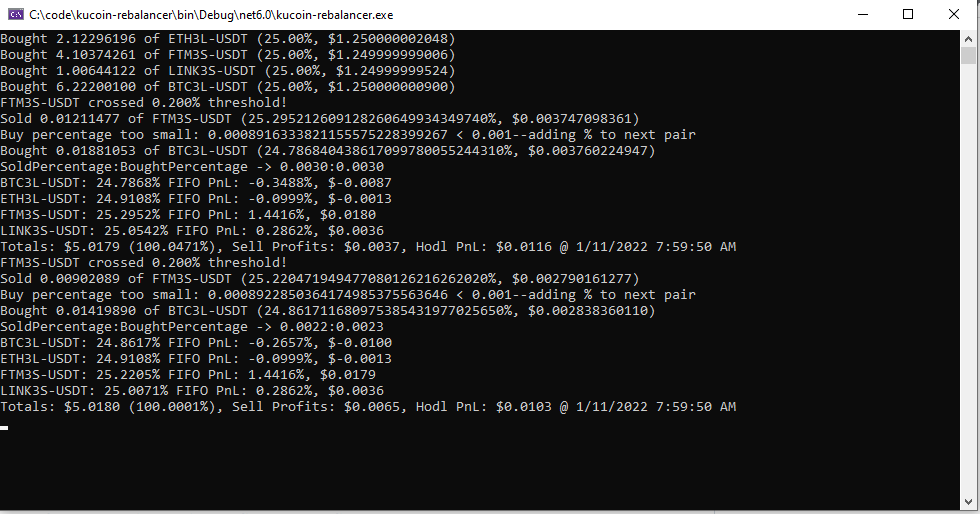

# kucoin-rebalancer
Simple threshold coin rebalancer for Kucoin

Instructions:

Create new C# console application

Include Kucoin.NET from Project->Nuget

Update Kucoin API key, secret, pass in Rebalancer class

Define pairs, percentage amounts, usdt amount and threshold for rebalance:

```csharp
List<PairInfo> pairs = new List<PairInfo>() {
    new PairInfo("BTC3L-USDT", .25m),
    new PairInfo("ETH3L-USDT", .25m),
    new PairInfo("FTM3S-USDT", .25m),
    new PairInfo("LINK3S-USDT", .25m),
    };

//$5 initial investment, 0.5% threshold for rebalancing 
Rebalancer r = new Rebalancer(Pairs: pairs, Amount: 5, Threshold: 0.005m, Paper: false); 
await r.Start();


```

More info about coin rebalancing:

https://blog.shrimpy.io/blog/a-comparison-of-rebalancing-strategies-for-cryptocurrency-portfolios
